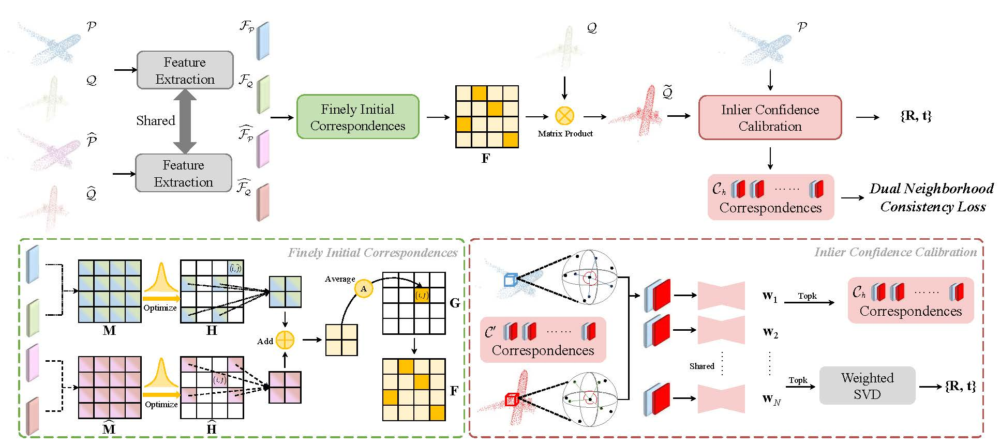

# Inlier Confidence Calibration for Point Cloud Registration (CVPR 2024)

[Yongzhe Yuan](https://yyzmars.github.io/) 1, Yue Wu1, Xiaolong Fan2, Maoguo Gong2, Qiguang Miao1, and Wenping Ma3

$^1$ School of Computer Science and Technology, Xidian University, China
$^2$ School of Electronic Engineering, Xidian University, China
$^3$ School of Artificial Intelligence, Xidian University, China
                     
          
This is the official implementation of our CVPR2024 paper [Inlier Confidence Calibration for Point Cloud Registration].

## Abstract
Inliers estimation constitutes a pivotal step in partially overlapping point cloud registration. Existing methods broadly obey coordinate-based scheme, where inlier confidence is scored through simply capturing coordinate differences in the context. However, this scheme results in massive inlier misinterpretation readily, consequently affecting the registration performance. In this paper, we explore to extend a new definition called inlier confidence calibration (ICC) to alleviate the above issues. Firstly, we provide finely initial correspondences for ICC in order to generate high quality reference point cloud copy corresponding to the source point cloud. In particular, we develop a soft assignment matrix optimization theorem that offers faster speed and greater precision compared to Sinkhorn. Benefiting from the high quality reference copy, we argue the neighborhood patch formed by inlier and its neighborhood should have consistency between source point cloud and its reference copy. Based on this insight, we construct transformation invariant geometric constraints and capture geometric structure consistency to calibrate inlier confidence for estimated correspondences between source point cloud and its reference copy. Finally, transformation is further calculated by the weighted SVD algorithm with the calibrated inlier confidence. Our model is trained in an unsupervised manner, and extensive experiments on synthetic and real-world datasets illustrate the effectiveness of the proposed method. 

